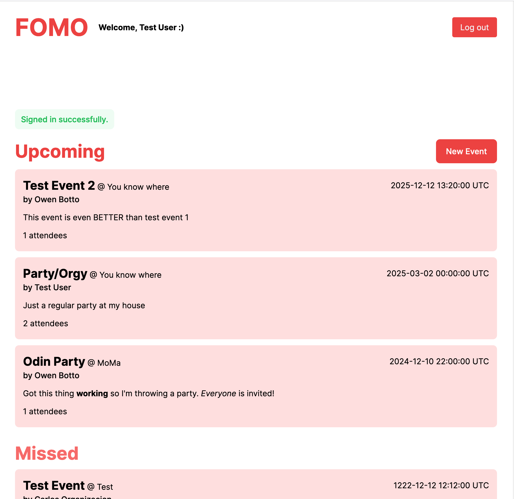

# Project: Private Events

_Part of The Odin Project curriculum_:
You want to build a site similar to a private Eventbrite which allows users to create events and then manage user signups.

A user can create events. A user can attend many events. An event can be attended by many users. Events take place at a specific date and at a location (which you can just store as a string, like “Andy’s House”).

More details on instructions provided can be found [here](https://www.theodinproject.com/lessons/ruby-on-rails-private-events).

## Final Result

Went on a limb and decided implementing google Oauth and went a bit extra with the styling using tailwind.

